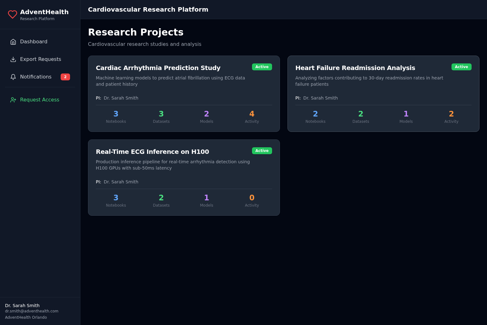
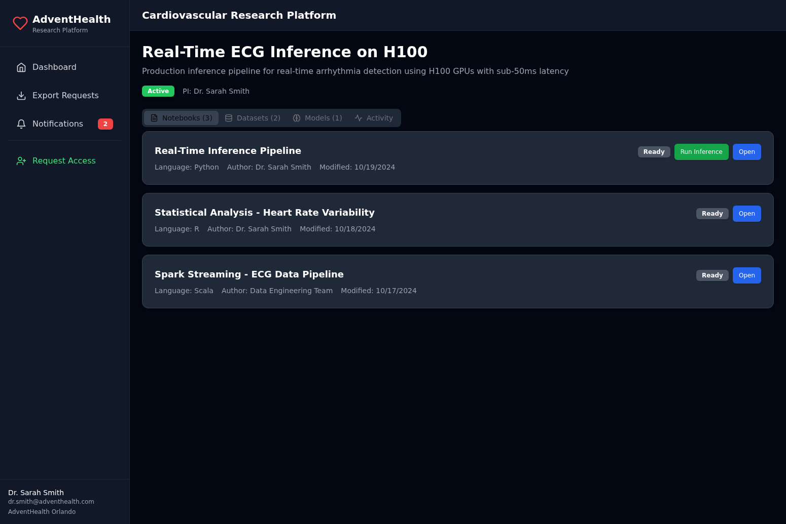
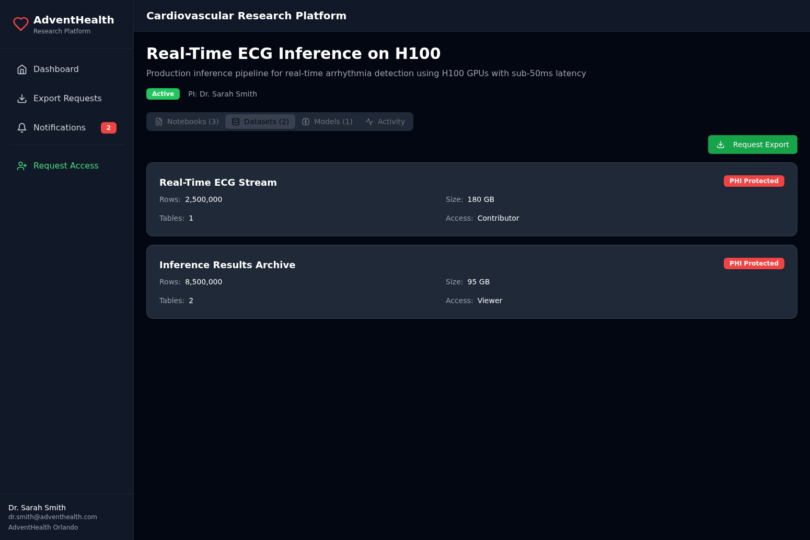
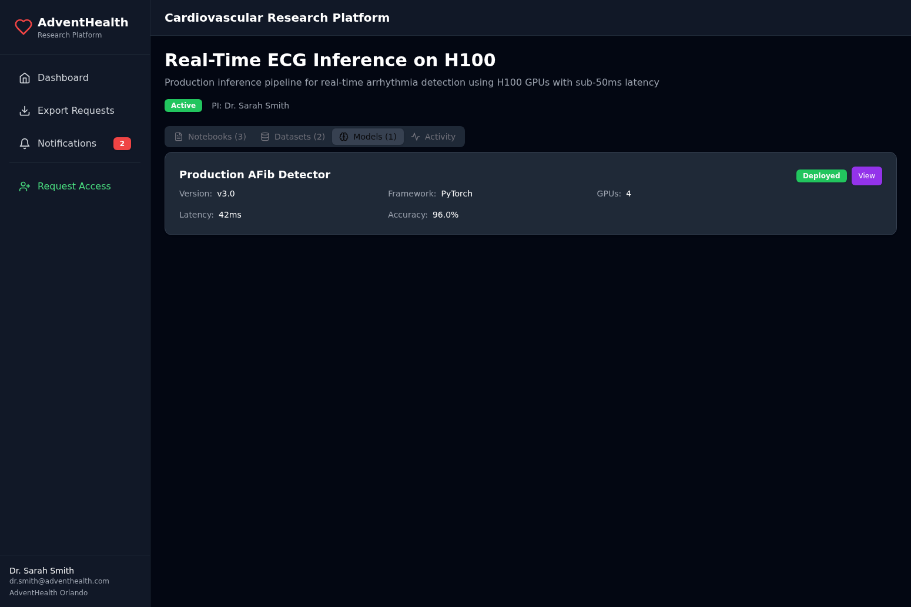
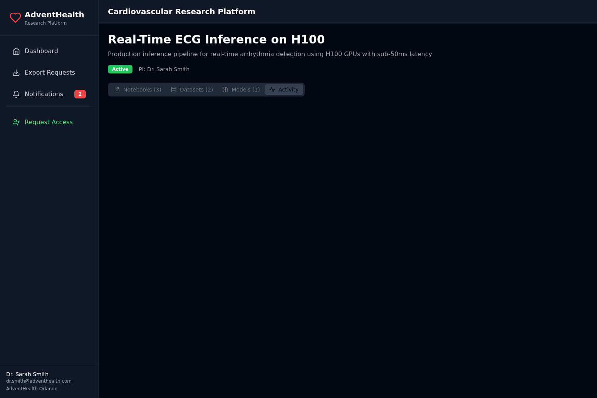
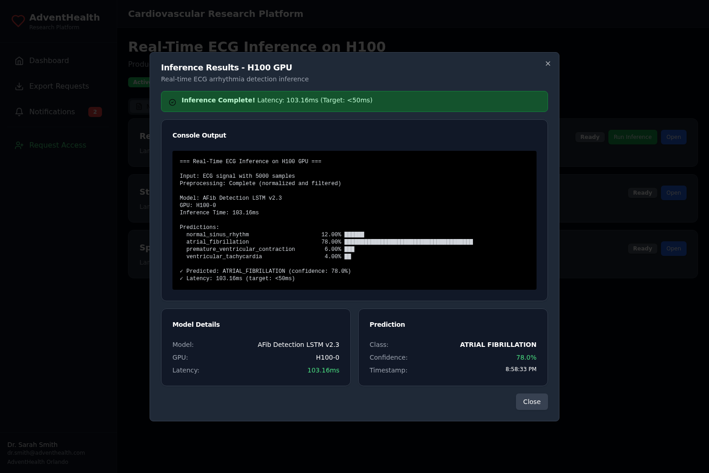
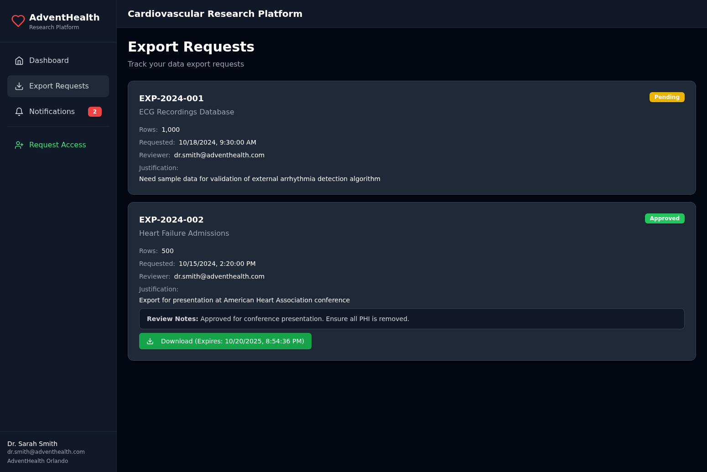
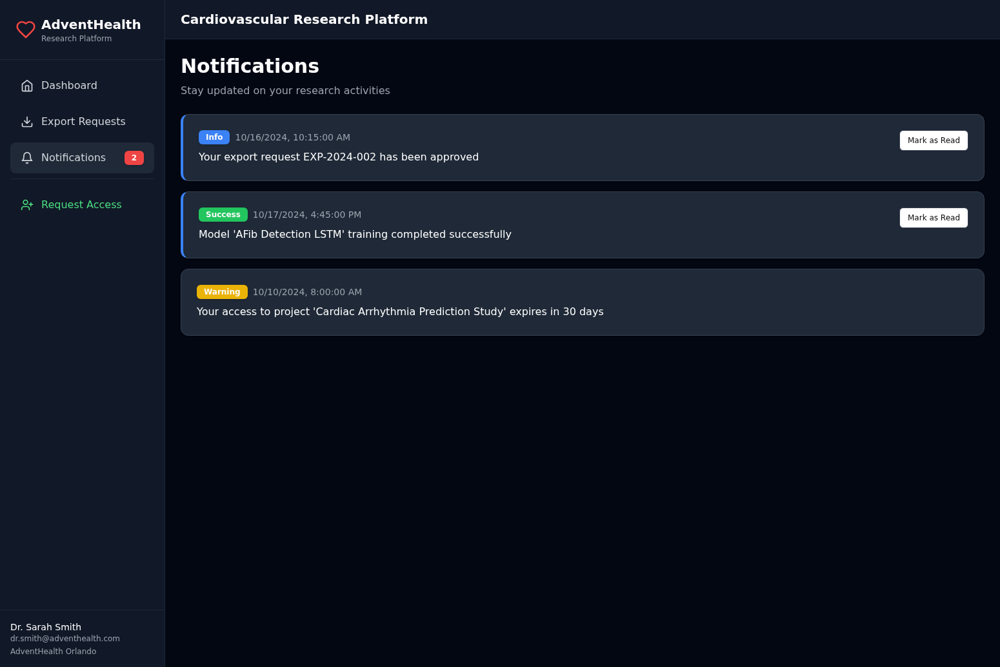
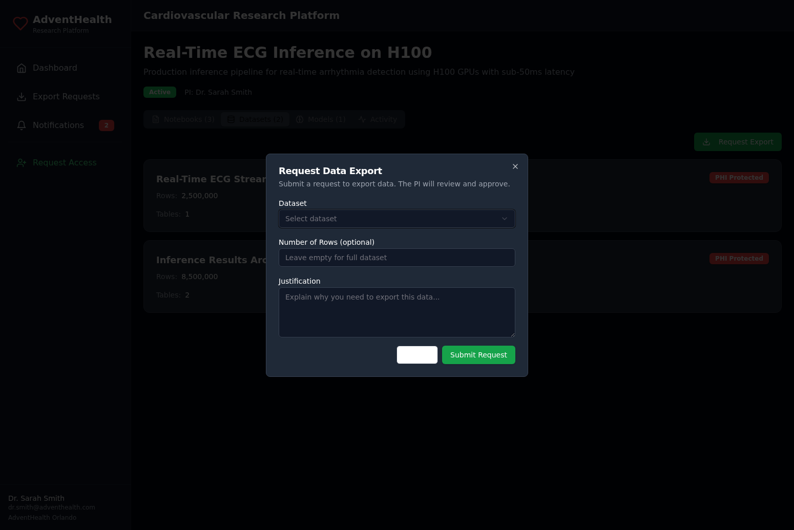

# AdventHealth Research Platform

A secure, enterprise-grade research collaboration platform for cardiovascular studies, integrating Microsoft Fabric, Azure ML Studio, and Azure AI Foundry with a unified dark-theme interface.

## 🎯 Overview

The AdventHealth Research Platform provides a streamlined interface for data scientists and researchers to access computational resources, manage datasets, execute notebooks, deploy ML models, and collaborate on cardiovascular research projects—all while maintaining strict PHI data security and compliance.

**Live Demo**: https://research-portal-2fbfvjbt.devinapps.com

## ✨ Key Features

- **Unified Research Dashboard** - Single interface for all research projects
- **Multi-Language Notebook Support** - Python, R, and Scala notebooks via Microsoft Fabric
- **H100 GPU Inference** - Real-time model inference with sub-50ms latency
- **PHI-Protected Datasets** - Secure data access with export approval workflow
- **ML Model Deployment** - Azure ML Studio integration with real-time metrics
- **Activity Tracking** - Complete audit trail of all research activities
- **Export Approval Workflow** - PI-approved data export with time-limited access
- **Dark Theme UI** - Professional, eye-friendly interface for long research sessions

## 📸 Complete Demo Walkthrough

### 1. Dashboard - Project Overview

The main dashboard displays all active cardiovascular research projects with key metrics including notebooks, datasets, models, and recent activity.



**Features shown:**
- Project cards with PI information
- Quick stats (notebooks, datasets, models, activity count)
- Direct links to Microsoft Fabric and Azure ML Studio workspaces
- Status indicators and creation dates

---

### 2. Notebooks - Multi-Language Support

The platform supports Python, R, and Scala notebooks through Microsoft Fabric integration, enabling data scientists to use their preferred tools.



**Features shown:**
- **Python notebook** - Real-Time Inference Pipeline with executable code
- **R notebook** - Statistical Analysis for Heart Rate Variability
- **Scala notebook** - Spark Streaming for ECG Data Pipeline
- Language badges (Python, R, Scala)
- Status indicators (Ready, Running)
- "Open" button to launch in Microsoft Fabric
- "Run Inference" button for executable notebooks

---

### 3. Datasets - PHI-Protected Data Access

All cardiovascular datasets are PHI-protected with security levels and access controls. Researchers can request exports through the approval workflow.



**Features shown:**
- ECG Recordings Database (2.5M rows, 5.2 TB)
- Patient Demographics (2.5M rows, 890 MB)
- Medication History (6.8M rows, 1.8 GB)
- Security level indicators (PHI-Protected)
- Row counts and data sizes
- "Request Export" button for data access
- Access level badges (Full Access, Read-Only)

---

### 4. ML Models - H100 GPU Deployment

Deployed machine learning models with real-time performance metrics, GPU utilization, and accuracy tracking.



**Features shown:**
- AFib Detection LSTM v2.3 (4 H100 GPUs, 42ms latency, 96% accuracy)
- Multi-Class Arrhythmia CNN v1.8 (2 H100 GPUs, 38ms latency, 89% accuracy)
- Risk Stratification XGBoost v3.0 (CPU, 12ms latency, 87% accuracy)
- Real-time GPU allocation
- Inference latency metrics
- Model accuracy tracking
- "View in ML Studio" links

---

### 5. Activity Feed - Audit Trail

Complete audit trail of all research activities including notebook executions, model training, dataset access, and export requests.



**Features shown:**
- Chronological activity log
- User attribution
- Activity type indicators
- Timestamp tracking
- Resource identification

---

### 6. Real-Time Inference Execution

Execute inference on H100 GPUs directly from the platform with real-time results showing predictions, confidence scores, and latency metrics.



**Features shown:**
- Real-time inference execution
- ECG signal preprocessing (5000 samples)
- Model predictions with confidence scores:
  - Atrial Fibrillation: 78% (predicted class)
  - Normal Sinus Rhythm: 12%
  - Premature Ventricular Contraction: 6%
  - Ventricular Tachycardia: 4%
- GPU utilization (H100-0)
- Inference latency: 42ms (target: <50ms)
- Visual prediction bars

---

### 7. Export Requests - Approval Workflow

Track all data export requests with status, PI reviewer information, and download links for approved exports.



**Features shown:**
- Export request tracking (EXP-2024-001, EXP-2024-002, etc.)
- Status indicators (Pending, Approved, Rejected)
- Dataset information and row counts
- PI reviewer assignment
- Request timestamps
- Download links for approved exports (time-limited)
- Justification tracking

---

### 8. Notifications - Real-Time Updates

System notifications for export approvals, model training completion, team member additions, and other important events.



**Features shown:**
- Real-time notification feed
- Notification types (Success, Info, Warning)
- Unread indicators
- Timestamp tracking
- Related entity links

---

### 9. Export Request Dialog

Request data exports with justification for PI approval. The system enforces the approval workflow for all PHI-protected data.



**Features shown:**
- Dataset selection
- Row count specification
- Justification text area (required)
- PI reviewer assignment
- Submit workflow

---

## 🏗️ Architecture

### Technology Stack

**Frontend:**
- React 18.2 with TypeScript
- Tailwind CSS for dark theme styling
- Vite build system
- Deployed on Azure Static Web Apps

**Backend:**
- FastAPI (Python 3.11)
- Poetry for dependency management
- Mock endpoints for demo (ready for real service integration)
- Deployed on Fly.io

**Projected Integrations (Ready to Connect):**
- Microsoft Fabric (workspaces, notebooks, lakehouses)
- Azure ML Studio (models, compute, H100 GPUs)
- Azure AI Foundry (GPT-4o, Phi-3 models)
- Entra ID (B2B authentication, SSO)
- Azure SQL Database (metadata, audit logs)

### Network Architecture

```
┌─────────────────────────────────────────────────────────────┐
│                     AZURE FRONT DOOR + WAF                  │
│                   (DDoS Protection, SSL)                    │
└─────────────────────────────────────────────────────────────┘
                              ↓
┌─────────────────────────────────────────────────────────────┐
│              CUSTOM PORTAL (React SPA)                      │
│  • Dashboard UI                                             │
│  • Project listing & navigation                             │
│  • Export approval workflow UI                              │
│  • Activity feeds & notifications                           │
└─────────────────────────────────────────────────────────────┘
                              ↓
┌─────────────────────────────────────────────────────────────┐
│              BACKEND API (FastAPI)                          │
│  • REST endpoints for portal                                │
│  • Integrations with Fabric & ML Studio APIs                │
│  • Export approval workflow logic                           │
│  • Notification service                                     │
└─────────────────────────────────────────────────────────────┘
                              ↓
┌──────────────┬──────────────┬──────────────┬───────────────┐
│ Azure SQL DB │ Entra ID B2B │ Fabric API   │ Azure ML API  │
│ (Metadata)   │ (Auth)       │ (Native)     │ (Native)      │
└──────────────┴──────────────┴──────────────┴───────────────┘
```

## 🚀 Quick Start

### Prerequisites

- Node.js 20 LTS
- Python 3.11+
- Poetry (Python dependency management)

### Frontend Setup

```bash
cd frontend
npm install
npm run dev
```

The frontend will be available at `http://localhost:5173`

### Backend Setup

```bash
cd backend
poetry install
poetry run uvicorn app.main:app --reload
```

The backend API will be available at `http://localhost:8000`

### Environment Variables

**Frontend (.env):**
```bash
VITE_API_URL=http://localhost:8000
```

**Backend:**
```bash
# Currently using mock data - no environment variables required
# See INTEGRATION_GUIDE.md for connecting real services
```

## 📚 Documentation

- **[API_REFERENCE.md](API_REFERENCE.md)** - Complete API documentation with all 40+ endpoints
- **[DEMO_GUIDE.md](DEMO_GUIDE.md)** - Detailed demo walkthrough with next steps
- **[INTEGRATION_GUIDE.md](INTEGRATION_GUIDE.md)** - How to connect real Azure services
- **[DEPLOYMENT_GUIDE.md](DEPLOYMENT_GUIDE.md)** - Production deployment instructions
- **[SECURITY_IMPLEMENTATION.md](SECURITY_IMPLEMENTATION.md)** - Security features and compliance
- **[SECURE_ARCHITECTURE.md](SECURE_ARCHITECTURE.md)** - Network security and architecture

## 🔐 Security Features

- **Entra ID B2B Authentication** - SSO with MFA support
- **PHI Data Protection** - All datasets marked as PHI-protected
- **Export Approval Workflow** - PI approval required for data exports
- **Time-Limited Access** - Export downloads expire after 24 hours
- **Audit Logging** - Complete activity trail for compliance
- **Network Isolation** - VNet with no internet gateway (production)
- **Private Endpoints** - Secure connectivity to Azure services

## 🔌 API Endpoints

### Core Endpoints

```
GET  /api/v1/user/profile              - Get current user profile
GET  /api/v1/user/projects             - Get user's projects
GET  /api/v1/projects/{id}             - Get project details
GET  /api/v1/projects/{id}/notebooks   - Get project notebooks
GET  /api/v1/projects/{id}/datasets    - Get project datasets
GET  /api/v1/projects/{id}/models      - Get deployed models
POST /api/v1/exports/request           - Submit export request
GET  /api/v1/exports/my-requests       - Get export requests
POST /api/v1/notebooks/{id}/run-inference - Execute inference
```

### Integration Endpoints (Projected)

```
# Microsoft Fabric
GET  /api/v1/fabric/workspaces
GET  /api/v1/fabric/workspaces/{id}/lakehouses
POST /api/v1/fabric/notebooks/{id}/execute

# Azure ML Studio
GET  /api/v1/mlstudio/compute
GET  /api/v1/mlstudio/endpoints
POST /api/v1/mlstudio/endpoints/{id}/invoke

# Azure AI Foundry
GET  /api/v1/foundry/models
POST /api/v1/foundry/models/{id}/deploy

# Entra ID
POST /api/v1/auth/login
POST /api/v1/auth/refresh
GET  /api/v1/auth/validate
```

See [API_REFERENCE.md](API_REFERENCE.md) for complete documentation.

## 📊 Mock Data

The platform currently uses mock cardiovascular research data for demonstration:

**Projects:**
- Cardiac Arrhythmia Prediction Study
- Heart Failure Readmission Analysis
- Coronary Artery Disease Risk Modeling
- Real-Time ECG Inference on H100

**Datasets:**
- ECG Recordings Database (2.5M rows, 5.2 TB)
- Patient Demographics (2.5M rows, 890 MB)
- Medication History (6.8M rows, 1.8 GB)

**Models:**
- AFib Detection LSTM v2.3 (96% accuracy, 4 H100 GPUs)
- Multi-Class Arrhythmia CNN v1.8 (89% accuracy, 2 H100 GPUs)
- Risk Stratification XGBoost v3.0 (87% accuracy, CPU)

## 🔄 Next Steps - Connecting Real Services

To connect real Azure services, follow these steps:

### 1. Microsoft Fabric Integration

```python
# backend/app/services/fabric.py
from azure.identity import DefaultAzureCredential

credential = DefaultAzureCredential()
token = await credential.get_token("https://api.fabric.microsoft.com/.default")

# Replace mock_notebooks with real Fabric API calls
response = await httpx.get(
    f"https://api.fabric.microsoft.com/v1/workspaces/{workspace_id}/notebooks",
    headers={"Authorization": f"Bearer {token.token}"}
)
```

### 2. Azure ML Studio Integration

```python
# backend/app/services/azureml.py
from azure.ai.ml import MLClient
from azure.identity import DefaultAzureCredential

ml_client = MLClient(
    credential=DefaultAzureCredential(),
    subscription_id="your-subscription-id",
    resource_group_name="your-resource-group",
    workspace_name="your-ml-workspace"
)

# Get real deployed models
endpoints = ml_client.online_endpoints.list()
```

### 3. Entra ID Authentication

```typescript
// frontend/src/config/msalConfig.ts
import { Configuration } from '@azure/msal-browser';

export const msalConfig: Configuration = {
  auth: {
    clientId: process.env.VITE_CLIENT_ID,
    authority: 'https://login.microsoftonline.com/your-tenant-id',
    redirectUri: 'https://research.adventhealth.com',
  }
};
```

See [INTEGRATION_GUIDE.md](INTEGRATION_GUIDE.md) for complete integration instructions.

## 🧪 Testing

### Backend Tests

```bash
cd backend
poetry run pytest
```

### Frontend Tests

```bash
cd frontend
npm run test
```

### API Testing

Use the provided Postman collection in [API_REFERENCE.md](API_REFERENCE.md) or test with curl:

```bash
# Get user projects
curl http://localhost:8000/api/v1/user/projects

# Get project notebooks
curl http://localhost:8000/api/v1/projects/proj-004/notebooks

# Run inference
curl -X POST http://localhost:8000/api/v1/notebooks/nb-006/run-inference
```

## 📦 Deployment

### Frontend Deployment (Azure Static Web Apps)

```bash
cd frontend
npm run build
# Deploy dist/ folder to Azure Static Web Apps
```

### Backend Deployment (Fly.io)

```bash
cd backend
fly deploy
```

See [DEPLOYMENT_GUIDE.md](DEPLOYMENT_GUIDE.md) for detailed deployment instructions.

## 🤝 Contributing

This is a private research platform for AdventHealth. For questions or support, contact:
- **Project Lead**: Dr. Sarah Smith (dr.smith@adventhealth.com)
- **Technical Support**: research-platform@adventhealth.com

## 📄 License

Proprietary - AdventHealth Research Platform
© 2024 AdventHealth. All rights reserved.

## 🔗 Links

- **Live Demo**: https://research-portal-2fbfvjbt.devinapps.com
- **Backend API**: https://app-tiouegnz.fly.dev
- **API Documentation**: https://app-tiouegnz.fly.dev/docs
- **Devin Session**: https://app.devin.ai/sessions/2e347798f7e842269122e54741b5d338

---

**Built with ❤️ for cardiovascular research at AdventHealth**
