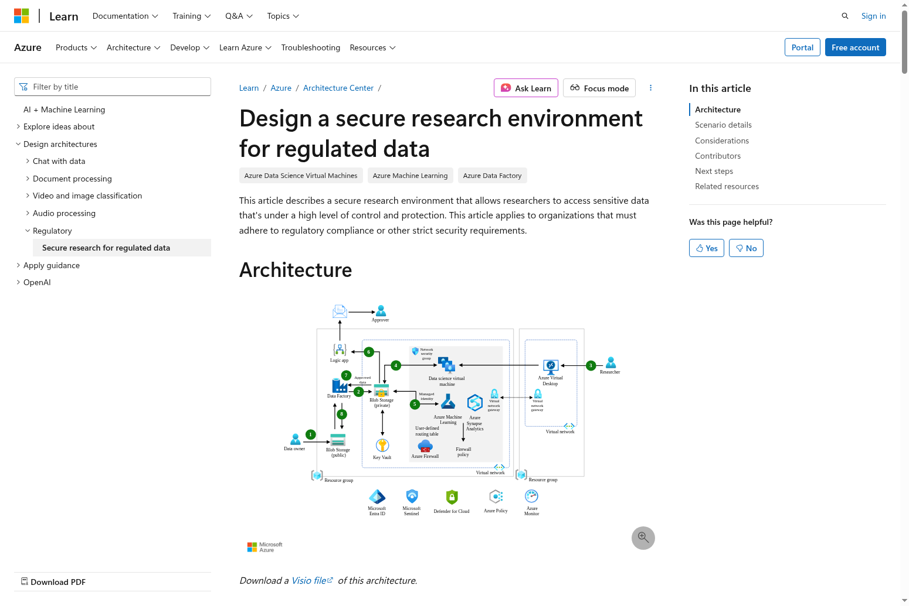

# Secure Research Environment (SRE) Architecture for ContosoHealth

## Overview

The ContosoHealth Research Platform implements Microsoft's Secure Research Environment (SRE) architecture to provide a secure, compliant environment for sensitive health data research while preventing data exfiltration.

## Architecture Diagram



## Core Principles

### 1. Network Isolation
- **No internet access** from compute resources
- **Private endpoints** for all Azure services
- **Network Security Groups (NSGs)** with deny-all-outbound rules
- **Azure Firewall** for controlled egress (service tags only)

### 2. Data Protection
- **Data stays in Azure** - no downloads to local machines
- **Approved results only** - aggregated statistics, models, visualizations
- **PI approval required** for all data exports
- **Time-limited access** to approved results (24-48 hours)

### 3. Identity & Access Management
- **Managed identities** for service-to-service authentication
- **Azure Entra ID B2B** for external researcher access
- **Role-based access control (RBAC)** with least privilege
- **Conditional access policies** with MFA enforcement

## SRE Components

### Network Architecture

```
┌─────────────────────────────────────────────────────────────────┐
│                        AZURE SUBSCRIPTION                        │
│                                                                  │
│  ┌────────────────────────────────────────────────────────────┐ │
│  │                    VIRTUAL NETWORK (VNet)                   │ │
│  │                   Address Space: 10.0.0.0/16                │ │
│  │                                                              │ │
│  │  ┌──────────────────────────────────────────────────────┐  │ │
│  │  │  Compute Subnet (10.0.1.0/24)                        │  │ │
│  │  │  - Azure ML Compute Instances                        │  │ │
│  │  │  - Microsoft Fabric Workspaces                       │  │ │
│  │  │  - H100 GPU Clusters                                 │  │ │
│  │  │  NSG: Deny all outbound internet                     │  │ │
│  │  └──────────────────────────────────────────────────────┘  │ │
│  │                                                              │ │
│  │  ┌──────────────────────────────────────────────────────┐  │ │
│  │  │  Private Endpoint Subnet (10.0.2.0/24)               │  │ │
│  │  │  - Azure Storage (OneLake)                           │  │ │
│  │  │  - Azure SQL Database                                │  │ │
│  │  │  - Azure Key Vault                                   │  │ │
│  │  │  - Azure Container Registry                          │  │ │
│  │  └──────────────────────────────────────────────────────┘  │ │
│  │                                                              │ │
│  │  ┌──────────────────────────────────────────────────────┐  │ │
│  │  │  Bastion Subnet (10.0.3.0/27)                        │  │ │
│  │  │  - Azure Bastion (for secure RDP/SSH)               │  │ │
│  │  └──────────────────────────────────────────────────────┘  │ │
│  │                                                              │ │
│  │  ┌──────────────────────────────────────────────────────┐  │ │
│  │  │  Firewall Subnet (10.0.4.0/26)                       │  │ │
│  │  │  - Azure Firewall (service tags only)                │  │ │
│  │  └──────────────────────────────────────────────────────┘  │ │
│  └────────────────────────────────────────────────────────────┘ │
│                                                                  │
│  ┌────────────────────────────────────────────────────────────┐ │
│  │                    PRIVATE DNS ZONES                        │ │
│  │  - privatelink.blob.core.windows.net                       │ │
│  │  - privatelink.database.windows.net                        │ │
│  │  - privatelink.vaultcore.azure.net                         │ │
│  │  - privatelink.azurecr.io                                  │ │
│  └────────────────────────────────────────────────────────────┘ │
└─────────────────────────────────────────────────────────────────┘
```

### Data Flow

```
┌─────────────────┐
│ External        │
│ Researcher      │
│ (B2B Guest)     │
└────────┬────────┘
         │ HTTPS (Entra ID Auth)
         ↓
┌─────────────────────────────────────────┐
│   Azure Front Door + WAF                │
│   (DDoS Protection, SSL Termination)    │
└────────┬────────────────────────────────┘
         │
         ↓
┌─────────────────────────────────────────┐
│   ContosoHealth Portal (Static Web App) │
│   - Dashboard UI                        │
│   - Project Management                  │
│   - Export Request Workflow             │
└────────┬────────────────────────────────┘
         │ Private Endpoint
         ↓
┌─────────────────────────────────────────┐
│   Backend API (App Service)             │
│   - REST Endpoints                      │
│   - Managed Identity Auth               │
│   - Export Approval Logic               │
└────────┬────────────────────────────────┘
         │ Private Endpoints
         ↓
┌────────┴────────┬──────────┬────────────┐
│                 │          │            │
↓                 ↓          ↓            ↓
┌─────────┐  ┌─────────┐  ┌─────────┐  ┌─────────┐
│ Fabric  │  │ Azure   │  │ Azure   │  │ Azure   │
│ (OneLake│  │ ML      │  │ SQL DB  │  │ Key     │
│ Storage)│  │ Studio  │  │         │  │ Vault   │
└─────────┘  └─────────┘  └─────────┘  └─────────┘
     │            │            │            │
     └────────────┴────────────┴────────────┘
                  │
                  │ NO INTERNET ACCESS
                  │ Data cannot leave Azure
                  ↓
         ┌─────────────────┐
         │ Approved Results│
         │ (Time-limited)  │
         │ SAS URLs        │
         └─────────────────┘
```

## Security Controls

### 1. Network Security

**Network Security Groups (NSGs)**
```json
{
  "securityRules": [
    {
      "name": "DenyAllOutbound",
      "properties": {
        "protocol": "*",
        "sourcePortRange": "*",
        "destinationPortRange": "*",
        "sourceAddressPrefix": "*",
        "destinationAddressPrefix": "Internet",
        "access": "Deny",
        "priority": 100,
        "direction": "Outbound"
      }
    },
    {
      "name": "AllowAzureServices",
      "properties": {
        "protocol": "Tcp",
        "sourcePortRange": "*",
        "destinationPortRange": "443",
        "sourceAddressPrefix": "VirtualNetwork",
        "destinationAddressPrefix": "AzureCloud",
        "access": "Allow",
        "priority": 110,
        "direction": "Outbound"
      }
    }
  ]
}
```

**Azure Firewall Rules**
- Allow only Azure service tags (Storage, SQL, KeyVault, MachineLearning)
- Deny all other outbound traffic
- Log all connection attempts for audit

### 2. Data Access Controls

**Managed Identities**
```python
# Backend API uses managed identity to access Azure services
from azure.identity import DefaultAzureCredential

credential = DefaultAzureCredential()

# Access Azure Storage (OneLake)
storage_client = BlobServiceClient(
    account_url="https://contosohealth.blob.core.windows.net",
    credential=credential
)

# Access Azure SQL Database
connection_string = "Server=tcp:contosohealth.database.windows.net;Authentication=Active Directory Default;"
```

**Private Endpoints**
- All Azure services accessed via private endpoints
- No public internet access to data stores
- DNS resolution via private DNS zones

### 3. Export Approval Workflow

**Step 1: Researcher Requests Export**
```python
# Researcher submits export request
POST /api/v1/exports/request
{
  "projectId": "proj-004",
  "resultType": "Model Predictions",  # NOT raw data
  "description": "AFib detection model predictions for validation",
  "justification": "Need predictions to validate model performance for publication"
}
```

**Step 2: PI Reviews Request**
```python
# PI reviews and approves/rejects
POST /api/v1/exports/{requestId}/review
{
  "decision": "Approved",
  "notes": "Approved for publication. Predictions only, no PHI.",
  "expirationHours": 24
}
```

**Step 3: Generate Time-Limited SAS URL**
```python
# Backend generates time-limited SAS URL for approved results
from azure.storage.blob import generate_blob_sas, BlobSasPermissions
from datetime import datetime, timedelta

sas_token = generate_blob_sas(
    account_name="contosohealth",
    container_name="approved-exports",
    blob_name=f"{request_id}.zip",
    permission=BlobSasPermissions(read=True),
    expiry=datetime.utcnow() + timedelta(hours=24)
)

download_url = f"https://contosohealth.blob.core.windows.net/approved-exports/{request_id}.zip?{sas_token}"
```

**Step 4: Researcher Downloads Results**
- Researcher receives email with download link
- Link expires after 24 hours
- Download logged in audit trail

### 4. Audit & Compliance

**Activity Logging**
```python
# All activities logged to Azure SQL Database
INSERT INTO ActivityLog (
    UserId, UserEmail, ProjectId, ActivityType, 
    ActivityDetails, ResourceId, IPAddress, CreatedAt
) VALUES (
    @userId, @userEmail, @projectId, 'ExportRequested',
    @activityDetails, @resourceId, @ipAddress, GETUTCDATE()
)
```

**Azure Monitor Integration**
- All API calls logged to Application Insights
- Network traffic logged to Azure Firewall logs
- Storage access logged to Azure Storage Analytics

## Implementation Checklist

### Phase 1: Network Setup
- [ ] Create VNet with subnets (Compute, Private Endpoint, Bastion, Firewall)
- [ ] Deploy Azure Firewall with service tag rules
- [ ] Configure NSGs with deny-all-outbound rules
- [ ] Set up Private DNS Zones for Azure services
- [ ] Deploy Azure Bastion for secure access

### Phase 2: Service Deployment
- [ ] Deploy Azure ML Workspace with private endpoint
- [ ] Deploy Microsoft Fabric Capacity with private endpoint
- [ ] Deploy Azure SQL Database with private endpoint
- [ ] Deploy Azure Key Vault with private endpoint
- [ ] Deploy Azure Storage (OneLake) with private endpoint

### Phase 3: Identity & Access
- [ ] Configure Managed Identities for all services
- [ ] Set up Entra ID B2B for external researchers
- [ ] Configure RBAC roles (Contributor, Viewer, PI)
- [ ] Enable Conditional Access policies with MFA
- [ ] Configure guest user access reviews

### Phase 4: Data Protection
- [ ] Enable encryption at rest (AES-256) for all storage
- [ ] Enable TLS 1.2+ for all connections
- [ ] Configure Azure Storage firewall (deny public access)
- [ ] Set up Azure SQL Database firewall (deny public access)
- [ ] Enable Azure Defender for all services

### Phase 5: Monitoring & Compliance
- [ ] Configure Application Insights for API monitoring
- [ ] Set up Azure Monitor alerts for security events
- [ ] Enable Azure Storage Analytics logging
- [ ] Configure log retention (7 years for HIPAA)
- [ ] Set up automated compliance reports

## Cost Estimate

| Service | SKU | Monthly Cost |
|---------|-----|--------------|
| Microsoft Fabric | F64 | $5,000 |
| Azure ML Compute (H100) | NC96ads_A100_v4 | $27,000 (on-demand) |
| Azure SQL Database | Business Critical | $500 |
| Azure Storage (OneLake) | Premium | $1,000 |
| Azure Firewall | Standard | $1,250 |
| Azure Bastion | Standard | $140 |
| Private Endpoints | 10 endpoints | $100 |
| Application Insights | Pay-as-you-go | $200 |
| **Total** | | **~$35,000/month** |

## Security Compliance

### HIPAA Compliance
- ✅ Encryption at rest and in transit
- ✅ Access controls with MFA
- ✅ Audit logging (7-year retention)
- ✅ Data exfiltration prevention
- ✅ Business Associate Agreement (BAA) with Microsoft

### Data Protection
- ✅ No raw PHI data exports
- ✅ Aggregated results only
- ✅ PI approval required
- ✅ Time-limited access
- ✅ Complete audit trail

## References

- [Microsoft Secure Research Environment Architecture](https://learn.microsoft.com/en-us/azure/architecture/ai-ml/architecture/secure-compute-for-research)
- [Azure Private Link](https://learn.microsoft.com/en-us/azure/private-link/)
- [Azure Firewall](https://learn.microsoft.com/en-us/azure/firewall/)
- [Azure Bastion](https://learn.microsoft.com/en-us/azure/bastion/)
- [Managed Identities](https://learn.microsoft.com/en-us/azure/active-directory/managed-identities-azure-resources/)
